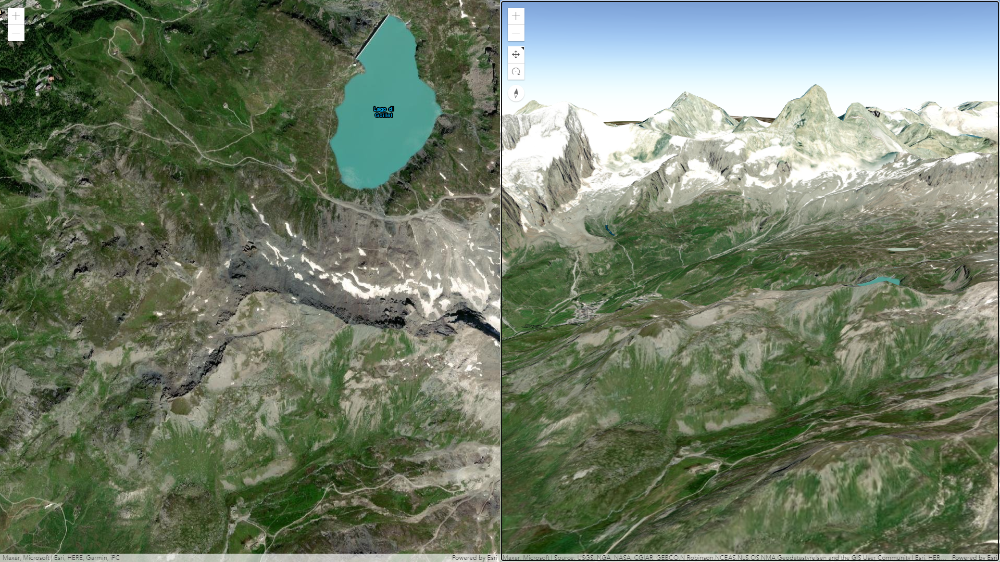
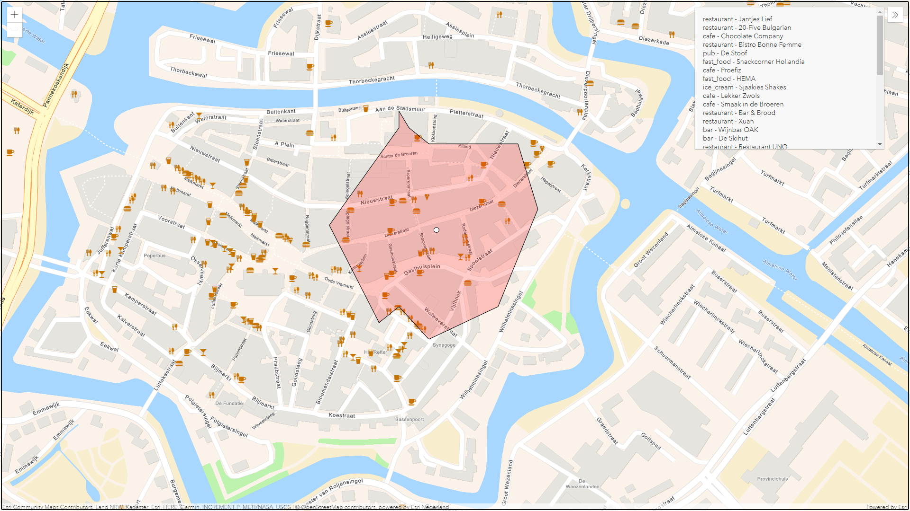

# WindesheimTrendwatch

# Laat je wijk oplichten

Door op wijk te klikken wordt de wijk polygoon opgelicht.

 
 
Live kaart:
[hier](https://esrinederland.github.io/CoolMaps/LayerBlending/index.html)
 
 

# Toon een kaart ook in 3D

In ArcGIS kun je niet alleen 2D kaarten zien, maar de hele wereld is ook in 3D beschikbaar.

 
 
Live kaart:
[hier](https://esrinederland.github.io/WindesheimTrendwatch/elevation.html)
 
 

# Ontdek welke horeca zich binnen 100 meter van je locatie bevindt

Klik op de kaart en een geografische analyse laat zien welke horeca zich binnen 100 meter van je locatie bevindt.

 
 
Live kaart:
[hier](https://esrinederland.github.io/WindesheimTrendwatch/drivetime.html)
 
 

# Opdrachten

 
 
https://storymaps.arcgis.com/stories/6251d494c39440a1b13c53fb3d7c4851
